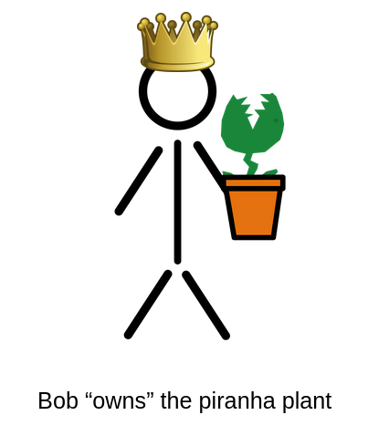
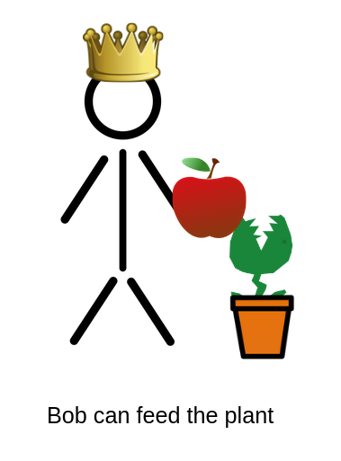
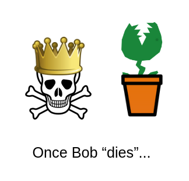
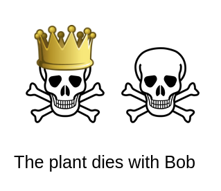
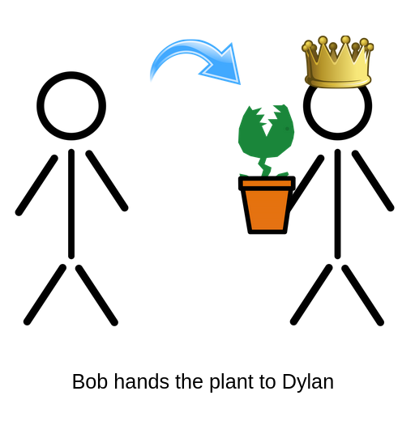
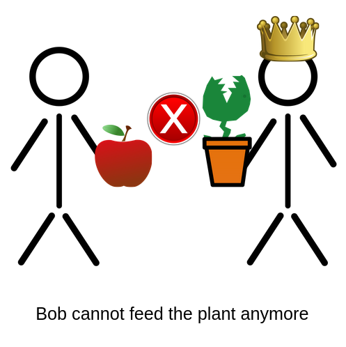
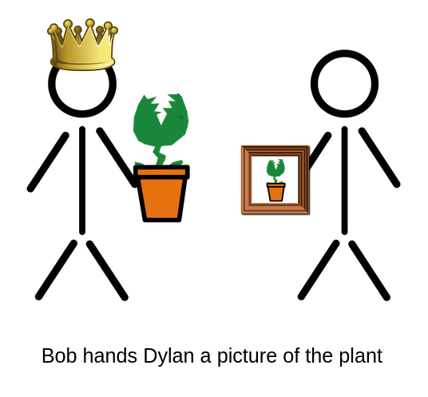
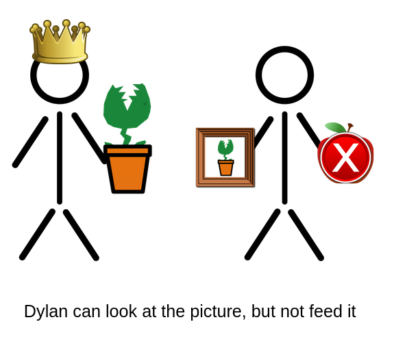
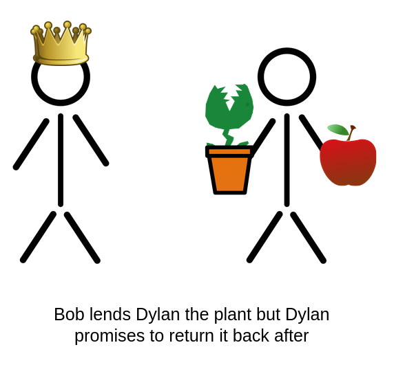

# Welcome to Rust

So...what is Rust?

Rust is a general-purpose multi-paradigm systems-level programming language,
often used as an alternative to `C` and `C++`, with a focus on low level
**performance** without sacrificing memory **safety**, and it achieves this via
an idea called single **ownership**, which is enforced by the compiler through
the borrow checker.

*Phew*, a lot of that likely went over your head so let me paraphrase it for you.

## Fast, Reliable, Productive - Pick Three

In short, Rust allows the programmer to write high level readable code while the
compiler does a lot of the heavy lifting, turning the source code into into
extremely performant machine code with speeds comparable to low level languages
like `C` and `C++`.

## Considering Rust

If you haven't caught the memo yet, Rust is fast, *REALLY* fast, which makes it
a great choice for programs that need to be performant, like operating systems,
game engines, backend servers, databases, the list can go on and on.

You don't even necessarily have to make your entire program in Rust, you can
keep writing your nice dynamically typed code and have it interact with performant
Rust code in specific performance critical areas (the exact way you'd do this
differs from language to language so I won't be going into detail here).

## WASM?

Also, given Rust's minimal runtime, it tends to have a decently compact binary
size, which currently makes it a good choice for Web Assembly for those of you
into that.

---

# Hello, World!

Alright, now that we've gotten the introductions out of the way, let's get right
into some code examples.

Whenever you introduce a new language, you're basically expected to show a
`Hello, World!` example, so here it is:
```rust
fn main() {
    println!("Hello, World!");
}
```
Simple enough.

> Note: the `!` after `println` denotes that `println` is actually a macro, not a
> function. Macros are actually quite a complex topic in Rust, so they won't be
> covered in-depth here.

## Running on local

If you want to run this on your own machine, you need to first install the
[rust compiler](https://www.rust-lang.org/tools/install) and after pasting
the code in a file like `main.rs`, execute the following commands:
```console
$ rustc main.rs
$ ./main
```
Or if on Windows:
```cmd
> rustc main.rs
> .\main.exe
```

---

# Variables

Variables in Rust can be declared with the `let` keyword:
```rust
#fn main() {
let x = 12;
println!("{}", x);
#}
```
The `println!` macro can be used to print values by inserting double curly
braces `{}` into the format string.

## Mutability

The following example won't run:

```rust
# fn main() {
let x = 12;
println!("x is {}", x);

x = 3;
println!("x is now {}", x);
#}
```
In Rust, all variables are *immutable* by default. This means, when you declare
a variable with `let`, you can guarantee that code later on will never be able
to modify the original value no matter what.

To mark a variable is *mutable*, add the `mut` keyword:

```rust
# fn main() {
let mut x = 12;
println!("x is {}", x);

x = 3;
println!("x is now {}", x);
#}
```

---

# Arrays

Creating an array in Rust is straight forward:

```rust
#fn main() {
let x = [1, 2, 3, 4, 5];
#}
```

To print an array, you need to format it in *debug* mode:

```rust
#fn main() {
#let x = [1, 2, 3, 4, 5];
println!("{:?}", x);
#}
```

## Indexing

Indexing and mutating works as expected:

```rust
#fn main() {
let mut x = [1, 2, 3, 4, 5];
println!("{}", x[1]);

x[1] = 100;
println!("{:?}", x);
#}
```

## Fixed size

One limitation, however, is that arrays in Rust are *fixed sized*, meaning they
can never grow or shrink. To create a dynamically sized list of items in rust,
we need to use a `Vec`.

---

# Vectors

Vectors in Rust can be created with the `Vec::new` function:

```rust
#fn main() {
let v: Vec<i32> = Vec::new();
#}
```

To add elements to it, use the `Vec::push` method:

```rust
#fn main() {
let mut v = Vec::new();
v.push(1);
v.push(2);
v.push(3);

println!("{:?}", v);
#}
```

## `vec!` macro

For conciseness, you may wish to use the `vec!` macro.

```rust
#fn main() {
let v = vec![1, 2, 3];
println!("{:?}", v);
#}
```

## Functions

Here's a function that takes a `Vec` as an argument:

```rust
fn main() {
    let v = vec![1, 2, 3];
    print_first(v);
}

fn print_first(v: Vec<i32>) {
    println!("{}", v[0]);
}
```

But, the code no longer compiles if we try to modify the vector after:

```rust
#fn main() {
let mut v = vec![1, 2, 3];
print_first(v);

v.push(4);
println!("{:?}", v);
#}
#
#fn print_first(v: Vec<i32>) {
#    println!("{}", v[0]);
#}
```

To better understand the error and fix it, we need to first learn about
**ownership**!

---

# Ownership

Rust's poster child feature is ownership (and borrowing), and is the biggest
hurdle that new Rustaceans must overcome before becoming truly comfortable with
the language.

Ownership has three* main rules:
1. Every value has an "owner"
2. Every value can be "moved"
3. Every value can be "borrowed"

I'll go in depth about each rule with an analogy and a code example along with it.

> *Note: The three rules listed here are not entirely complete, as there are a few
> more rules pertaining to mutable vs immutable borrows, but it won't be covered
> here.
>
> The Rust Book goes into more detail about the full rules of ownership if you're
> interested.

## Owning

In Rust, every value has a single owner who is responsible for it.



```rust
#fn main() {
// The variable `bob` owns the vector
let bob = vec![1, 2, 3];
#}
```

The owner can do whatever they want with the value.



```rust
#fn main() {
let mut bob = Vec::new();

// The vector can be mutated
bob.push(1);
bob.push(2);
println!("{:?}", bob);
#}
```

But, if the owner disappears...



```rust
fn main() {
    let mut bob = Vec::new();
    bob.push(1);
    bob.push(2);
} // Once `bob` goes "out of scope"
```

...the value will be disposed of.



```rust
fn main() {
    let mut bob = Vec::new();
    bob.push(1);
    bob.push(2);

    // The value gets implicitly destroyed
    drop(bob);
}
```

> Note: in the case of `Vec`, "destroying" it means deallocating the memory from
> the heap.

## Moving

Ownership can be transfered.



```rust
fn take(v: Vec<i32>) {
    // Does stuff with `v`
}

#fn main() {
let bob = vec![1, 2, 3];

// Give bob's value to the `take` function
take(bob);
#}
```
or
```rust
fn give() -> Vec<i32> {
    // Returns a `Vec`
#     vec![1, 2, 3]
}

#fn main() {
let dylan = give();
#}
```

The old owner can no longer access the value.



```rust
#fn main() {
let mut bob = vec![1, 2, 3];
take(bob);

// The vector CANNOT be accessed anymore
bob.push(4);
println!("{:?}", bob);
#}
#
#fn take(v: Vec<i32>) { }
```

## Borrowing

Values can be borrowed without transferring ownership.



```rust
// Function takes a reference as a parameter (&T)
fn borrow(v: &Vec<i32>) {
    // Does stuff with `v`
}

#fn main() {
let mut bob = vec![1, 2, 3];

// Give a reference (&) to bob's value
borrow(&bob);

bob.push(4); // Still okay!
println!("{:?}", bob);
#}
```

Immutable borrows (&) "can look, but cannot touch."



```rust
# fn main() { borrow(&vec![1, 2, 3]); }
fn borrow(v: &Vec<i32>) {
    println!("{:?}", v); // Okay!
}
```

```rust
# fn main() { borrow(&vec![1, 2, 3]); }
fn borrow(v: &Vec<i32>) {
    v.push(1); // ERROR!
}
```

Mutable borrows (&mut) CAN modify the value.



```rust
// Function takes a mutable reference as a parameter (&mut T)
fn change(v: &mut Vec<i32>) {
    v.push(4);
}

#fn main() {
let mut bob = vec![1, 2, 3];

// Give a mutable reference
change(&mut bob);

// Okay!
bob.push(5);
println!("{:?}", bob);
#}
```

> Note: if `bob` was not declared as a `mut` variable, it couldn't be mutably
> borrowed.
>
> This ensures that, to anyone reading the code, if a variable is not declared
> as mutable, it will **NEVER** be updated under any circumstance.
>
> (this is technically untrue if we were to dive into the spooky world of
> *unsafe Rust*, but that's not going to be talked about here)

## Fix me!

Let's go back to our previous broken code, but this time with a new understanding
of ownership and borrowing.

Try to fix this code such that the function `print_first` borrows the vector
rather than taking the ownership of it.

```rust,editable
// I'm editable!!
fn main() {
    let mut v = vec![1, 2, 3];
    print_first(v);

    v.push(4);
    println!("{:?}", v);
}

fn print_first(v: Vec<i32>) {
    println!("{}", v[0]);
}
```

If you successfully did it, you should get the output:

```
1
[1, 2, 3, 4]
```

---

# Options

In Rust, the `Option<T>` type is often used to refer to a value that
*may or may not* exist.

`Option<T>` may have two variations:
- `Some(T)` for when a value is present
- `None` for when a value is absent

```rust
#fn main() {
let mut maybe = Some(12);
println!("{:?}", maybe);

maybe = None;
println!("{:?}", maybe);
#}
```

A built-in function in Rust that returns an `Option<T>` is `Vec::pop`, which
removes and returns the last value of a vector:

```rust
#fn main() {
let mut v = vec![1, 2];

println!("{:?}", v.pop());
println!("{:?}", v.pop());
println!("{:?}", v.pop());
#}
```

> **Why not null?**
>
> A common question is "Why not just use `null` like other languages?" and the
> biggest reason is to prevent "null dereferencing" or `NullPointerExceptions`.
>
> In a language like Java where objects can be set to `null` whenever they want,
> you often don't know when you should have null-checks or not, so you usually
> just put them everywhere or risk a runtime exception.
>
> In Rust, however, that isn't necessary!
>
> If a value is of type `T`, you know it definitely exists, and so you have no
> fear of a possible null dereference.
>
> If a value is of type `Option<T>`, the Rust compiler forces you to do the
> check because it may or may not be a valid value, meaning you run no risk
> of a runtime error.

# Match

So, let's say we wanted to do something if a value is `Some` and another thing
if it is `None`, how do we do that? With pattern matching!

In Rust, the `match` keyword allows you to match a given value against a specified
list of patterns:

```rust,editable
fn main() {
    let x = Some(12);
    match x {
        // Matching a specific value
        Some(10) => println!("10 is the magic number"),
        // Binding a value to a variable
        Some(n) => println!("We have the number {}", n),
        None => println!("We don't have a number"),
    }
}
```

The above code is editable. Try changing the value of `x` or add your own patterns
and see what happens!

## Alternative Patterns

The pipe `|` can be used to create a pattern that matches multiple things:

```rust,editable
fn main() {
    let x = Some(12);
    match x {
        Some(10 | -10) => println!("10 is the magic number"),
        Some(n) => println!("We have the number {}", n),
        None => println!("We don't have a number"),
    }
}
```

## Wildcard

The wildcard pattern `_` can be used to match *anything*:

```rust,editable
fn main() {
    let x = Some(12);
    match x {
        Some(10 | -10) => println!("10 is the magic number"),
        _ => println!("We didn't get 10"),
    }
}
```

# Iterators

Iterators in Rust can be used to, well, iterate over a stream of values.
Alternatively, they can be modified to create a new iterator or consumed
to generate a single value.

## `.iter()`

Arrays and vectors can both be easily turned into iterators with the `iter` method:

```rust
#fn main() {
let arr = [1, 2, 3];
arr.iter();

let v = vec![1, 2, 3];
v.iter();
#}
```

## Looping

Iterators can be looped over with the humble `for`-loop

```rust
#fn main() {
let arr = [1, 2, 3];
for i in arr.iter() {
    println!("{}", i);
}
#}
```

## Ranges

Simple range iterators can be created using the syntax `n..m` for all numbers
`n` to `m` non-inclusive:

```rust
#fn main() {
for i in 0..10 {
    println!("{}", i);
}
#}
```

## `.sum()`

Iterators have a `sum` method to add up all of the elements in the iterator:

```rust
#fn main() {
let result: i32 = (1..10).sum();
println!("{}", result);
#}
```

## `.map()`

Iterators have a `map` method which applies a function to every element in the iterator:

```rust
#fn main() {
for i in (0..10).map(|n| n * n) {
    println!("{}", i);
}
#}
```

> Note: `|n| n * n` is an example of an anonymous function in Rust.
>
> It could be roughly translated as:
>
> ```rust
> # fn main() {}
> fn square(n: i32) -> i32 {
>     n * n
> }
> ```

## Quiz time!

You hopefully now have a general understanding of what iterators are and what they
can do. The next few examples will show of some more tricks, but don't just skim
right through them. Try and predict what the output of them might be, and see if
you're correct after taking a guess.

```rust,editable
fn f(n: u32) -> u32 {
    (1..=n).product()
}

fn main() {
    println!("{}", f(1));
    println!("{}", f(2));
    println!("{}", f(5));
}
```

> Note: `n..=m` is how you'd create a range that goes from `n` to `m` *inclusive*.

```rust,editable
fn main() {
    let n = (0..100)
        .filter(|n| n % 2 == 0)
        .count();

    println!("{}", n);
}
```

```rust,editable
fn main() {
    let values: Vec<i32> = (0..100)
        .map(|n| n * n)
        .collect();

    println!("{}", values[1]);
    println!("{}", values[2]);
    println!("{}", values[20]);
}
```

> Note: in this case, `collect` collects all of the values of the iterator into a `Vec`.

# Appendix

Congrats! You've reached the end! These were all of the examples that I was able to
fit in the final presentation (plus a little more).

If you want to learn more about Rust, I highly recomend reading
[The Rust Book](https://doc.rust-lang.org/book/). It goes in waaaay more detail than
I did here, so do please check it out if you're interested.